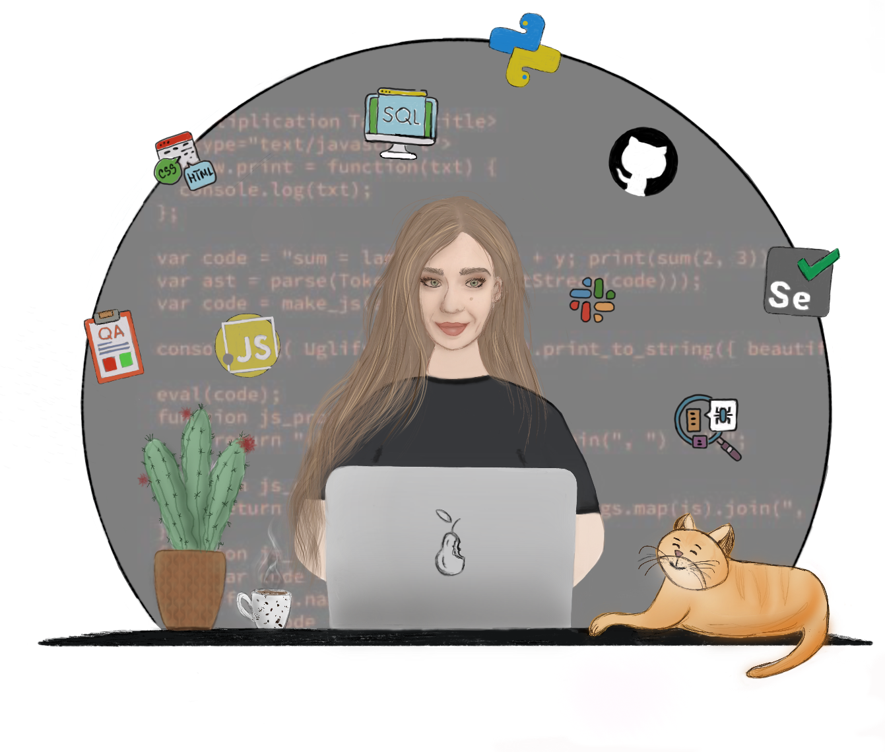

  
# I'm Inga

---

## QA Software Engineer 
#### with experience in both Automation and Manual Testing

 

## Languages and Tools:

&nbsp;

&nbsp; 
  
&nbsp; 
 
&nbsp;
&nbsp;  
&nbsp;
&nbsp;
&nbsp; 
&nbsp;  
&nbsp; 
&nbsp; 
&nbsp; 
&nbsp;  
 
&nbsp;
&nbsp;
&nbsp;

 

## Connect with me:

 
 

*Feel free to reach out if you have any questions, opportunities, or just want to connect!   I'm always excited to collaborate and contribute to impactful projects.  Let's make software testing better together!*

 

  <!-- Typing SVG by DenverCoder1 - https://github.com/DenverCoder1/readme-typing-svg -->
  

 

 𝘐𝘯 𝘮𝘺 𝘧𝘳𝘦𝘦 𝘵𝘪𝘮𝘦, 𝘐 𝘦𝘯𝘫𝘰𝘺   𝘤𝘺𝘤𝘭𝘪𝘯𝘨, 𝘩𝘪𝘬𝘪𝘯𝘨, 𝘥𝘳𝘢𝘸𝘪𝘯𝘨 𝘪𝘯 𝘗𝘳𝘰𝘤𝘳𝘦𝘢𝘵𝘦, 𝘢𝘯𝘥 𝘤𝘳𝘰𝘤𝘩𝘦𝘵𝘪𝘯𝘨 𝘈𝘮𝘪𝘨𝘶𝘳𝘶𝘮𝘪 𝘵𝘰𝘺𝘴.   

 

